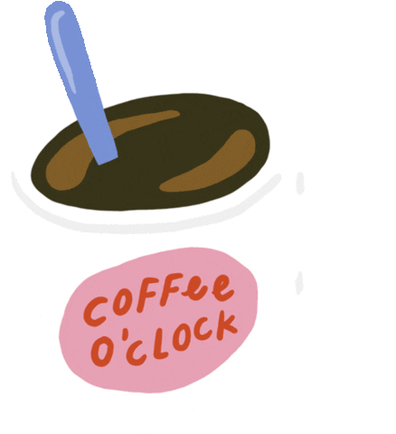

### I'm Mayu 


```
a Journalist from Barcelona, self-taught film-maker, photography lover since I remember who's worked as communicator for grassroots organizations and as audiovisual freelance around Europe and Central America
```
Eager learner, restless and concerned curious person, couldn't help but to go comprehend what is going on behind the technology that surrounds us and increasingly shapes the world, so now I've become a...

#  👩‍💻 Full Stack developer

Which has turned to be both challenging and fun!

### Languages and Tools 🛠️
<p align="left">
  <a href="https://github.com/search?q=user%3ADenverCoder1+language%3Ahtml"></a>
  <a href="https://github.com/search?q=user%3ADenverCoder1+language%3Acss"></a>
      <a href="https://github.com/search?q=user%3ADenverCoder1+language%3Ajava"></a>
      <a href="https://github.com/search?q=user%3ADenverCoder1+language%3Ajavascript"></a>
    <a href="https://github.com/search?q=user%3ADenverCoder1+language%3Aphp"></a>
   <a href="#"></a>
   <a href="#"></a>
   <a href="#"></a>  
   <a href="#"></a>  
  <a href="https://github.com/search?q=user%3ADenverCoder1+language%3Asass"></a>
  <a href="#"></a>
  <a href="#"></a>
  <a href="#"></a>
  <a href="#"></a>
  <a href="#"></a>
  <a href="#"></a>
    <a href="#"></a>
  <a href="#"></a>
  <a href="#"></a>
  <a href="#"></a>
    <a href="#"></a>
  <a href="#"></a>
  <a href="#"></a>
</p>

</br> 

### Some things I  💜


</br>
<a> I'm also a craft beer specialist and a carpenter apprendice who likes gardening, sporting, reading and dancing</a>
</br>
</br>
</br>

#### From zero to hero🦸‍♀️ine, currently learning:
- [ ] Microservices
- [ ] Docker
- [ ] CI/CD
- [ ] Redux
- [ ] Next.js
